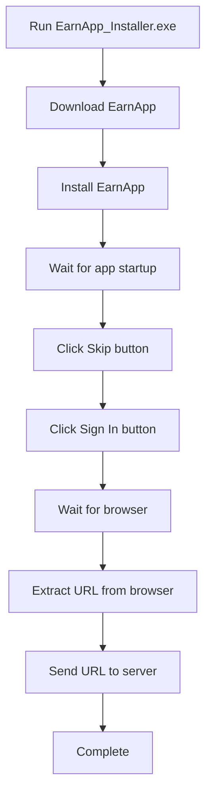

# EarnApp Auto Installer Client

## 📋 Tổng quan

Tool tự động cài đặt **EarnApp** và gửi URL kích hoạt về server để quản lý hàng loạt máy client.

---

## 🚀 Cách sử dụng nhanh

### 1. Cấu hình Server URL
```batch
# Chạy file này để thay đổi server URL
Configure-Server.bat
```

### 2. Chạy Client
```batch
# Chạy với quyền Administrator
EarnApp_Installer.exe
```

---

## ⚙️ Cấu hình chi tiết

### Thay đổi Server URL
1. **Cách 1: Dùng Configure-Server.bat**
   - Chạy `Configure-Server.bat`
   - Nhập URL server mới (ví dụ: `http://192.168.1.100:8080/cb`)
   - Chạy `Recompile-Client.bat` để build lại EXE

2. **Cách 2: Chỉnh sửa trực tiếp**
   - Mở `Main.au3`
   - Tìm dòng: `Global Const $SERVER_URL = "http://..."`
   - Thay đổi URL
   - Chạy `Recompile-Client.bat`

---

## 🖥️ Yêu cầu hệ thống

- **OS**: Windows 7+ (64-bit)
- **Permissions**: Administrator rights  
- **Network**: Internet connection
- **AutoIt**: Chỉ cần nếu muốn recompile (tùy chọn)

---

## 📂 Cấu trúc file

```
EarnApp_Client/
├── EarnApp_Installer.exe    # Main executable
├── Main.au3                 # Source code (main)
├── Auto_Install.au3         # Download & install script
├── Click_Skip.au3           # Skip button automation
├── Click_Signin.au3         # Sign-in button automation  
├── Copy_Url.au3            # URL extraction & callback
├── ImageSearchEx_UDF/      # Image search library
├── Configure-Server.bat    # Easy server configuration
├── Recompile-Client.bat    # Rebuild EXE after changes
├── README.txt              # Detailed documentation
└── USER_GUIDE.md          # This guide
```

---

## 🔄 Quy trình hoạt động



---

## 📡 Server API

Client sẽ gửi POST request đến server:

### Endpoint
```
POST /cb
Content-Type: application/json
```

### Success Response
```json
{
    "client_id": "client_A1B2C3D4",
    "status": "SUCCESS", 
    "message": "https://earnapp.com/r/abc123def456",
    "ip": "192.168.1.50",
    "computer": "PC-CLIENT-01"
}
```

### Error Response  
```json
{
    "client_id": "client_A1B2C3D4",
    "status": "FAILED",
    "message": "File not found: Auto_Install.au3",
    "ip": "192.168.1.50", 
    "computer": "PC-CLIENT-01"
}
```

---

## 🔧 Troubleshooting

### ❌ EXE không chạy
- **Nguyên nhân**: Thiếu quyền Administrator
- **Giải pháp**: Right-click → "Run as administrator"

### ❌ Không tìm thấy EarnApp window
- **Nguyên nhân**: App chưa khởi động đầy đủ
- **Giải pháp**: Tăng thời gian chờ trong script

### ❌ Không copy được URL
- **Nguyên nhân**: Browser chưa mở hoặc wrong window
- **Giải pháp**: Đảm bảo Chrome browser được mở

### ❌ Callback thất bại  
- **Nguyên nhân**: Server URL sai hoặc server offline
- **Giải pháp**: 
  1. Kiểm tra server đang chạy: `http://YOUR_SERVER:8080/status`
  2. Kiểm tra firewall
  3. Update server URL với `Configure-Server.bat`

### ❌ AutoIt script errors
- **Nguyên nhân**: Missing dependencies
- **Giải pháp**: Đảm bảo tất cả file .au3 và ImageSearchEx_UDF/ có trong thư mục

---

## 🔄 Rebuild Instructions

Nếu cần thay đổi code và rebuild:

### Method 1: Using batch script
```batch
# After editing Main.au3 or other .au3 files
Recompile-Client.bat
```

### Method 2: Manual compile
```batch  
"C:\Program Files (x86)\AutoIt3\Aut2Exe\Aut2exe.exe" /in "Main.au3" /out "EarnApp_Installer.exe" /comp 4 /x86
```

---

## 📞 Support

- Check console output for detailed error messages
- Review server logs for callback issues  
- Ensure all dependencies are in the same folder as EXE

---

**Version**: 1.0  
**Created**: 2025-10-09  
**Compatible**: Windows 7+ (x86/x64)